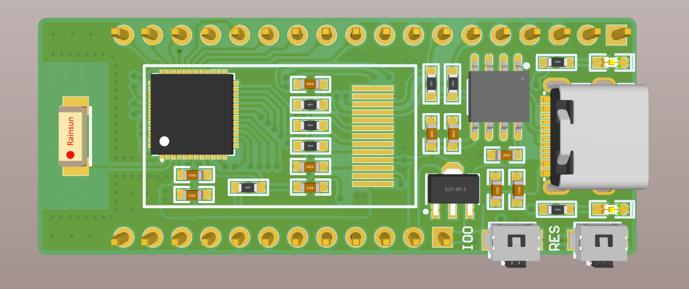
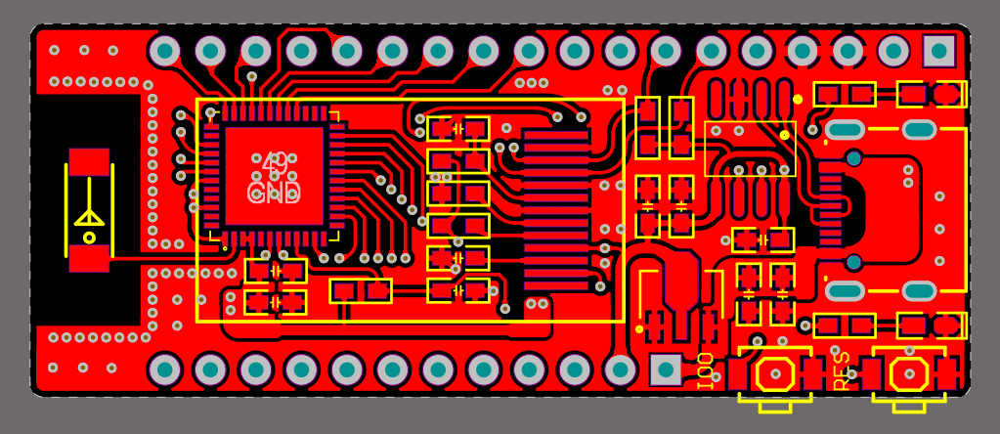
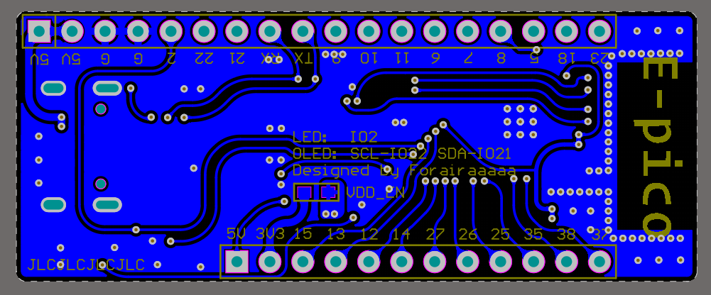
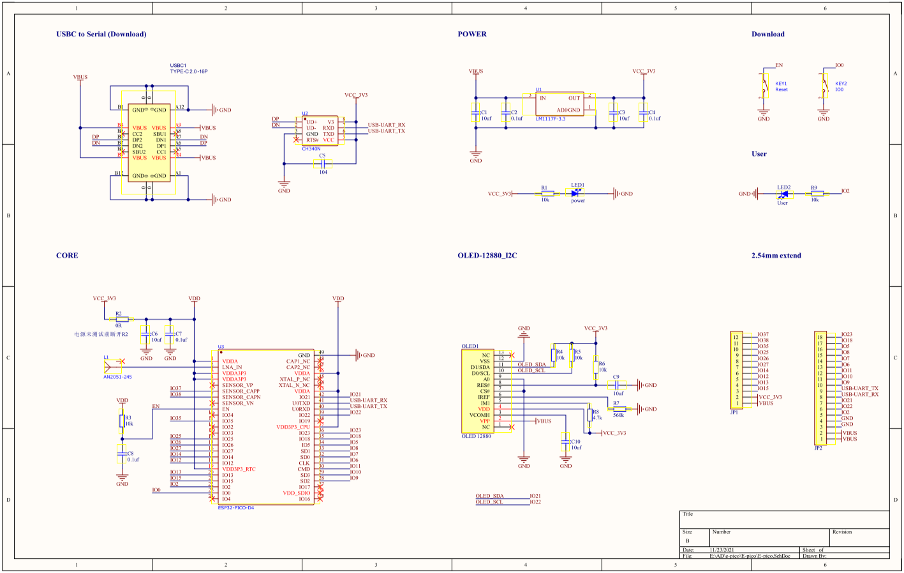

# E-pico

E-pico 是稚晖君项目 [ESP32-PicoDK](https://github.com/peng-zhihui/ESP32-PicoDK) 的个人衍生版本，意在刚学AD后练手...  学完更加坚定等 Kicad6 了~

与原版相比，阉割CAN、IMU功能，所有容阻更换 0603 封装，CP2102更换为CH340N。

PCB Layout 方面，主要元件的分布上参考原版，布线自由发挥..  故引出引脚与原版不同。

- 优点：元件全部分布在顶层，方便手工贴片和加热台焊接
- 缺点：
  1. 替换CP2102代价，需手动进入下载模式下载程序（这点主要是👴菜
  2. 第一次基于裸芯片画 ESP32 开发板，仅供参考

#### 开发板资源

- ESP32-PICO-D4 主控，兼容 Arduino、ESP-IDF 平台
- 128x80 I2C OLED 屏幕
- TypeC 接口 USB-TTL
- 2.4G陶瓷天线
- 引出大部分引脚

#### 引脚定义

- OLED 屏幕的 I2C 引脚定义与原版一致，即：
  1. SCL：IO22
  2. SDA：IO21
- 板载 led：IO2

#### 焊接注意

- 建议钢网 + 加热台
- 开发板背面的 **VDD_EN** 焊盘封装为主控的电源使能，建议焊接完成后先上电测试，电源确认无异后短接焊盘（0R电阻、焊锡）
- 原理图上的 OLED 背光阻值不合适，偏暗，焊接时自行更换

#### 程序下载

1. 与同类 ESP32 开发板类似，使用板载的 TypeC 接口与 PC 连接
2. **按住 IO0 按钮的同时，按下 RES 按键（复位键），以进入下载模式**
3. 在平台上点击烧写（ArduinoIDE、PlatformIO...）
4. **烧写完成后再按下 RES 按键退出下载模式**
5. 下载完成

#### 参考程序

由于屏幕接口与稚晖君原版一致，故 OLED 使用参考[原版](https://github.com/peng-zhihui/ESP32-PicoDK/tree/main/2.Samples)即可，其余可参考[ESP32官方Arduino仓库](https://github.com/espressif/arduino-esp32/tree/master/libraries)

#### 参考图片                                                                                                                                                     

#### 原理图

